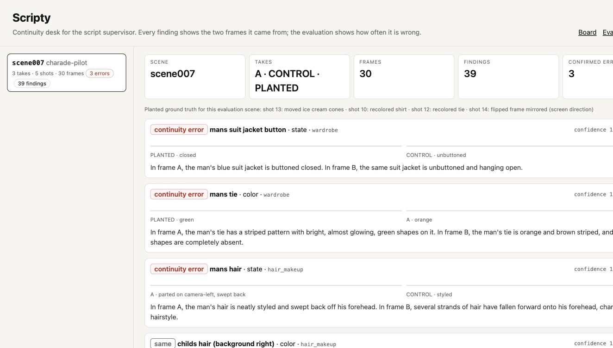
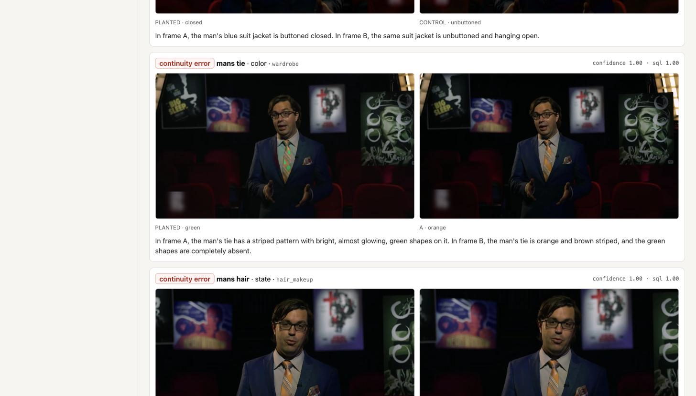

# Scripty

**The continuity agent for script supervisors — and the first one that publishes its own false-positive rate.**

A script supervisor ("scripty") keeps a film's continuity: the wine glass that was half full, the tie that was knotted, which hand held the cigarette, which side of frame each actor stood on. On set they photograph everything and compare by eye. Scripty reads the takes instead: Gemini inventories every sampled frame into (entity, attribute, value) rows, **ClickHouse** finds every entity whose attribute changed across takes or shots of the same scene, a second Gemini look rules each candidate *continuity error / intentional change / same*, and an ADK agent answers the supervisor's questions through the official `mcp-clickhouse` MCP server. Every finding shows the two frames it came from.

Live: https://scripty-q62ufgdryq-uc.a.run.app




Built solo for Agentic Cinema (Google Cloud × ClickHouse track). Google Cloud at runtime: Vertex AI Gemini 2.5 Flash / Pro (`google-genai`), Google ADK (`google-adk`), Cloud Run. Partner at runtime: `mcp-clickhouse` against a ClickHouse cluster.

## Why this is hard, measured

Nobody has shipped continuity checking because the intentional-vs-error problem stalls it: a glass that empties because the actor drank is not an error. Instead of claiming to have solved it, Scripty **measures how badly it fails** on a pre-registered evaluation (`docs/EVAL_PLAN.md`): real scenes from public-domain films, a jittered CONTROL take with no semantic change, and a PLANTED take with known errors (prop removed / moved / recoloured, frame mirrored). Recall, precision and the control false-positive rate are published whatever they turn out to be, with the pass/fail threshold written before the run. Two matchers are reported: the plan's ("entity words or category", which the pilot showed over-counts) and a strict one (same shot and entity-word overlap) — `scripts/rescore.py`, both from the same findings.

## Run

```bash
uv sync && cp .env.example .env         # ClickHouse + Vertex settings
uv run scripty shots data/raw/charade.mp4
uv run scripty ingest --project charade --scene s001 --take A clip.mp4
uv run scripty analyze --project charade --scene s001
uv run uvicorn scripty.app:app --port 8080
```

Evaluation: `uv run python -m scripty.eval_cli data/raw/charade.mp4 charade` writes `docs/eval/charade.json` and the app renders it at `/`.

Apache-2.0.
